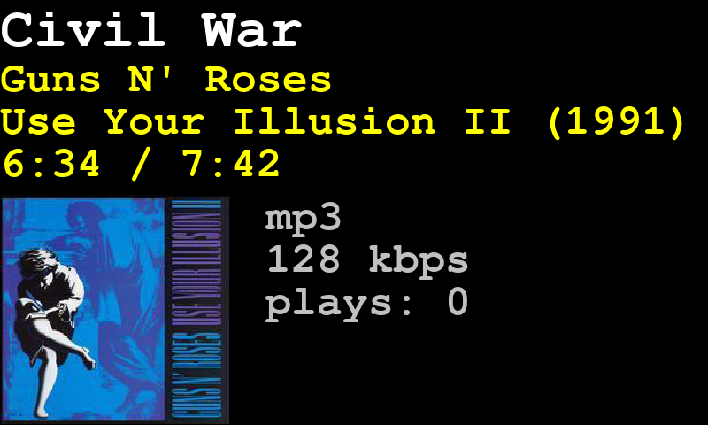

# plexmon
Monitor on a Raspberry PI LCD screen what Plex is playing on an Amazon Echo device



Raspberry PI with screen
 * https://photos.app.goo.gl/Q23Nja5fsSCRhAc46

This is the display I'm using:
 * https://www.amazon.com/gp/product/B07JZHLWGM
 * https://github.com/iUniker/3.6NewDriver.git

Install the pygame package and pip
 * sudo apt-get install python-pygame
 * sudo apt-get install python-pip

And the plex API
 * sudo pip install plexapi

Before the script can be used it must have a token.  Edit this line in the code
```
token = '<your token>'
```
Use this article to find your token
 * https://support.plex.tv/articles/204059436-finding-an-authentication-token-x-plex-token/

## WebSocket issue

A problem with this version of websocket
```
>>> import websocket
>>> websocket.__version__
'0.56.0'
```
Edit the file
```
sudo vi /usr/local/lib/python2.7/dist-packages/websocket/_app.py
```
Make this change.
```
def _callback(self, callback, *args):
    if callback:
       try:
           if inspect.ismethod(callback):
               callback(self, *args) # brett
           else:
               callback(self, *args)
```
